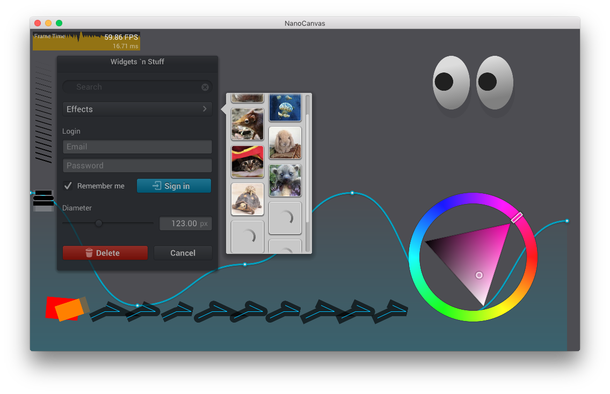

# NanoCanvas, portable JavaScript vector graphics engine.

NanoCanvas is a portable vector graphics engine using JavaScript binding of NanoVG.
NanoCanvas is build on top of Duktape, NanoVG and OpenGL2(or GLESv2).

## Platform

* Mac OS X
* Linux
* Windows
* iOS/Android(TODO)

## Requirements

* OpenGL2
  * GLESv2
* premake5

## Build

### Linux and MacOSX

    $ premake5 gmake
    $ cd build
    $ make

### Windows

Visual Studio 2015 is required to build an example.

    > premake5.exe vs2015
    > cd build

Open solution file and build it with Visual Studio 2015.

Visual Studio 2013 may work. To compile with Visual Studio 2013 use the following premake flag.

    > premake5.exe vs2013

## Example

See `example/main.cc` and `example/input.js`.

## License

NanoCanvas example code is licensed under MIT license.
NanoCanvas uses third party libraries. See `LICENSES` file for more details.

## TODO

* [ ] Expressive error handling.
* [ ] Expressive error report of parsing JavaScript code.
* [ ] Refactor source code.
* [ ] Text paragraph
* [ ] Mouse interaction

